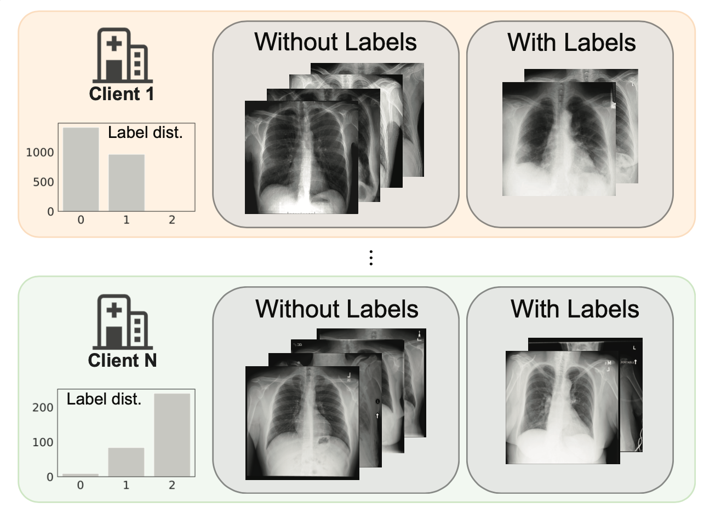
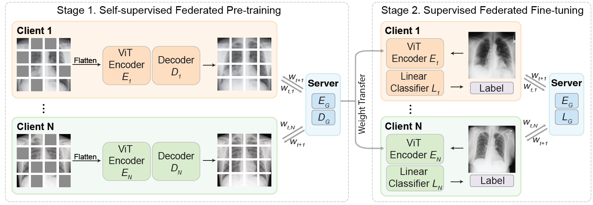

Self-supervised Federated Learning (SSL-FL)
===========
### Label-Efficient Self-Supervised Federated Learning for Tackling Data Heterogeneity in Medical Imaging 

[ArXiv]() | [Cite](#reference)

***TL;DR:** Pytorch implementation of self-supervised federated learning framework proposed in [our paper]() for simulating self-supervised classification on multi-institutional medical imaging data using federated learning.

- Our framework employs masked image encoding as self-supervised task to learn efficient representations from images.
- Extensive experiments are performed on diverse medical datasets including retinal images, dermatology images and chest X-rays.
- In particular, we implement BEiT and MAE as the self-supervision learning module.

<!-- [] -->


## Pre-requisites:
### Set Up Environment
* ```conda env create -f environment.yml```
* then ```pip install torch===1.7.1+cu110 torchvision===0.8.2+cu110 torchaudio===0.7.2 -f https://download.pytorch.org/whl/torch_stable.html```
* NVIDIA GPU (Tested on Nvidia Tesla V100 32G x 4, and Nvidia GeForce RTX 2080 Ti x 8 on local workstations
* Python (3.8.12), torch (1.7.1+cu110), numpy (1.21.2), pandas (1.4.2), scikit-learn (1.0.2), scipy (1.7.1), seaborn (0.11.2)

### Data Preparation
We will release the data preparation instruction and the data soon.
<table><tbody>
<!-- START TABLE -->
<!-- TABLE HEADER -->
<th valign="bottom"></th>
<th valign="bottom">Retina</th>
<th valign="bottom">Derm</th>
<th valign="bottom">COVID-FL</th>
<th valign="bottom">Skin-FL</th>
<!-- TABLE BODY -->
<tr><td align="left">pre-trained checkpoint</td>
<td align="center">TODO</a></td>
<td align="center">TODO</td>
<td align="center">TODO</td>
<td align="center">TODO</td>
</tr>
</tbody></table>

<!-- ### Download gdrive for file uploading (optional)
Step1: ```wget https://github.com/prasmussen/gdrive/releases/download/2.1.1/gdrive_2.1.1_linux_386.tar.gz```

Step2: ```tar -xvf gdrive_2.1.1_linux_386.tar.gz```

Step3: ```./gdrive about```

Step4: ```./gdrive upload /home/documents/file_name.zip```

Step5: ```./gdrive list``` -->

## Self-supervised Federated Learning for Medical Image Classification
### Self-supervised Federated Pre-training
(i.e., pre-training directly on decentralized target task data)

You can run self-supervised Federated Pre-training on your own datasets with the following python files: 
- Fed-BEiT: ```beit/run_beit_pretrain_FedAvg.py```
- Fed-MAE: ```mae/run_mae_pretrain_FedAvg.py```

If you want to test on new datasets, please modify datasets.py and FedAvg_utils/data_utils.py

We also provide the **Pre-trained Checkpoints** as follows. In this paper, we choose ViT-B/16 as the backbone for all the methods:

`BEiT-B`: #layer=12; hidden=768; FFN factor=4x; #head=12; patch=16x16 (#parameters: 86M)

The models were pretrained with 224x224 resolution.

The following table provides the pre-trained checkpoints used in the paper:
#### Fed-BEiT Retina
<table><tbody>
<!-- START TABLE -->
<!-- TABLE HEADER -->
<th valign="bottom"></th>
<th valign="bottom">Split-1</th>
<th valign="bottom">Split-2</th>
<th valign="bottom">Split-3</th>
<!-- TABLE BODY -->
<tr><td align="left">pre-trained checkpoint</td>
<td align="center"><a href="https://drive.google.com/file/d/1cMRtumZUm9Ftt8AssuKSUoxACkCEmaAg/view?usp=sharing">download</a></td>
<td align="center"><a href="https://drive.google.com/file/d/1x_xdQDHFjEpwCq4AyMflHW8QITP3tvN5/view?usp=sharing">download</a></td>
<td align="center"><a href="https://drive.google.com/file/d/1TPgoyqYK2ZBn4GmOdXX5AlDe8CrgWpx-/view?usp=sharing">download</a></td>
</tr>
</tbody></table>

#### Fed-MAE Retina
<table><tbody>
<!-- START TABLE -->
<!-- TABLE HEADER -->
<th valign="bottom"></th>
<th valign="bottom">Central</th>
<th valign="bottom">Split-1</th>
<th valign="bottom">Split-2</th>
<th valign="bottom">Split-3</th>
<!-- TABLE BODY -->
<tr><td align="left">pre-trained checkpoint</td>
<td align="center"><a href="https://drive.google.com/file/d/1Sih-9HPISfaR48DplmbvYmtv_xh2V8RJ/view?usp=sharing">download</a></td>
<td align="center"><a href="https://drive.google.com/file/d/18cG2rrweNKc8LS5LBTcUAt9A4om3YWGz/view?usp=sharing">download</a></td>
<td align="center"><a href="https://drive.google.com/file/d/1Rdfm_o5CFWucLKckiOYbBr9UfEfcPaOu/view?usp=sharing">download</a></td>
<td align="center"><a href="https://drive.google.com/file/d/1StZmgbxP0VWNane3K0R8jb8sVm2Xm3H4/view?usp=sharing">download</a></td>
</tr>
</tbody></table>

#### Fed-BEiT COVID-FL
<table><tbody>
<!-- START TABLE -->
<!-- TABLE HEADER -->
<th valign="bottom"></th>
<th valign="bottom">Central</th>
<th valign="bottom">Real-world Split</th>
<!-- TABLE BODY -->
<tr><td align="left">pre-trained checkpoint</td>
<td align="center"><a href="https://drive.google.com/file/d/1WI9TnIudIUmIfC6t3OyjPSR0T0LVlg7G/view?usp=sharing">download</a></td>
<td align="center"><a href="https://drive.google.com/file/d/1B7fcORHeUB2rKTUu0vlTXqrcOc-XVub-/view?usp=sharing">download</a></td>
</tr>
</tbody></table>

#### Fed-MAE COVID-FL
<table><tbody>
<!-- START TABLE -->
<!-- TABLE HEADER -->
<th valign="bottom"></th>
<th valign="bottom">Central</th>
<th valign="bottom">Real-world Split</th>
<!-- TABLE BODY -->
<tr><td align="left">pre-trained checkpoint</td>
<td align="center"><a href="https://drive.google.com/file/d/1Ma55OepDzjcGHRYHVg4GahCxH9OY16gm/view?usp=sharing">download</a></td>
<td align="center"><a href="https://drive.google.com/file/d/16FIte4hkp5I9MUztEcgmAA2F02_2Zr1S/view?usp=sharing">download</a></td>
</tr>
</tbody></table>

### Supervised Pre-training with ImageNet-22k
Download the ViT-B/16 weights pre-trained on ImageNet-22k:
- ```wget https://storage.googleapis.com/vit_models/imagenet21k/ViT-B_16.npz```

See more details in https://github.com/google-research/vision_transformer.

### Self-supervised pre-training with ImageNet-22k
**BEiT ImageNet: **
Download BEiT weights pre-trained on ImageNet-22k: 
- ```wget https://unilm.blob.core.windows.net/beit/beit_base_patch16_224_pt22k.pth```

Download Dall-e tokenizers: 
- ```wget https://cdn.openai.com/dall-e/encoder.pkl```
- ```wget https://cdn.openai.com/dall-e/decoder.pkl```

**MAE ImageNet: **
Download MAE weights pretrained on ImageNet-22k:
- ```wget https://dl.fbaipublicfiles.com/mae/pretrain/mae_pretrain_vit_base.pth```

##  Self-supervised Federated Fine-Tuning
You can also run self-supervised Federated Fine-tuning on your own datasets with the following python files: 
- Fed-BEiT: ```beit/run_class_finetune_FedAvg.py```
- Fed-MAE: ```mae/run_class_finetune_FedAvg.py```

Scripts are in beit/script and mae/script. More details about model training will be added.

## Funding
This work was funded by National Institutes of Health (NIH) under grants R01CA256890, R01CA227713, and U01CA242879.

## Reference
The current work is on Arxiv and under review. If you find our work helpful in your research or if you use the code or datasets, please consider citing our paper. 

## Acknowledgements
* This repository is based on [BEiT](https://github.com/microsoft/unilm/tree/master/beit) and [MAE](https://github.com/facebookresearch/mae).
* The main FL setup is based on prior work ["Rethinking Architecture Design for Tackling Data Heterogeneity in Federated Learning"](https://github.com/Liangqiong/ViT-FL-main)
